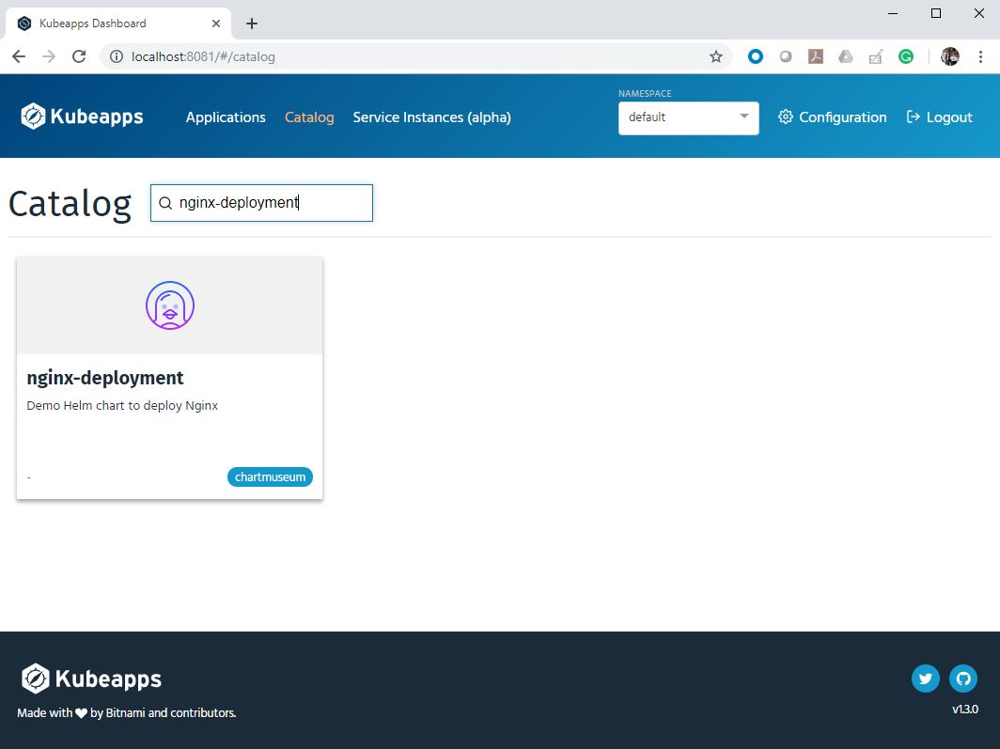

+++
menutitle = "ChartMuseum"
date = 2018-12-29T17:15:52Z
weight = 8
chapter = false
pre = "<b>- </b>"
+++

# ChartMuseum

[comment]:[](https://chartmuseum.com/)
<div >
<a href="https://chartmuseum.com" target="_blank"></a>
</div>
We can use ChartMuseum to host our own Helm packages.
In this session , we will configure ChartMuseum and will add the repository to Kubeapps

We will also upload the nginx-deployment helm package that we have created in earlier session to our local repository.

- Download and configure chartmuseum

```shell
$ curl -LO https://s3.amazonaws.com/chartmuseum/release/latest/bin/linux/amd64/chartmuseum
```

{}
We will be using <b>/{HOME}/chartstorage</b> directory to store the packages
{}

```shell
$ chmod +x ./chartmuseum
$ sudo mv ./chartmuseum /usr/local/bin
$ mkdir ./chartstorage
```

- Create a systemd service file.

```console
cat <<EOF | sudo tee /etc/systemd/system/chartmuseum.service
[Unit]
Description=Helm Chartmuseum
Documentation=https://chartmuseum.com/

[Service]
ExecStart=/usr/local/bin/chartmuseum \\
 --debug \\
 --port=8090 \\
 --storage="local" \\
 --storage-local-rootdir="/home/${USER}/chartstorage/"
Restart=on-failure
RestartSec=5

[Install]
WantedBy=multi-user.target
EOF
```

- Start chartmuseum

```shell
$ sudo systemctl daemon-reload
$ sudo systemctl start chartmuseum
$ sudo systemctl enable chartmuseum
```

>Output

```console
Created symlink from /etc/systemd/system/multi-user.target.wants/chartmuseum.service to /etc/systemd/system/chartmuseum.service.
```

- Package our Helm chart

```shell
$ cd nginx-deployment/
$ helm package .
```

>Output

```console
Successfully packaged chart and saved it to: /home/ubuntu/nginx-deployment/nginx-deployment-2.tgz
```

- Upload package to ChartMuseum

The URL IP is the IP of system which the chartmuseum service is running.

```shell
$ curl -L --data-binary "@/home/ubuntu/nginx-deployment/nginx-deployment-2.tgz" 192.168.31.20:8090/api/charts
```

- Also add the repository to helm

```shell
$ helm repo add chartmuseum http://192.168.31.20:8090
```

- Add repo to Kubeapps

Click `Configuration` -> `App Repositories` -> `Add App Repository`

Fill `Name` and `URL` , then click `Install Repo`


- Repo will appear in the list after addition


- View the Helm packages which is hosted in ChartMuseum

Click `Catalog` and search `nginx-deployment`

Remember , we have added an `icon` in our `Chart.yaml` file . You can see the same icon in deployment.


