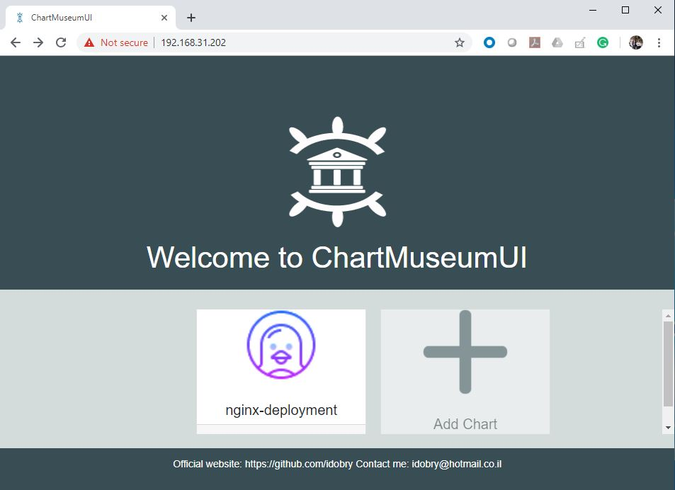

+++
menutitle = "ChartMuseum UI"
date = 2018-12-29T17:15:52Z
weight = 9
chapter = false
pre = "<b>- </b>"
+++

# ChartMuseum UI

Earlier we used `curl` command to upload our first helm package.
In this session , we will configure a UI for our local repository so that we can add/delete packages easily.

- Set `CHART_MUSESUM_URL` variable to the local repo URL.

```shell
CHART_MUSESUM_URL=http://192.168.31.20:8090
```

- Create a deployment and service for UI.

```yaml
cat <<EOF >chartmuseum-ui.yaml
apiVersion: v1
kind: Service
metadata:
  creationTimestamp: null
  name: chartmuseum-ui
spec:
  ports:
  - port: 80
    protocol: TCP
    targetPort: 8080
  selector:
    run: chartmuseum-ui
  type: LoadBalancer
---
apiVersion: apps/v1
kind: Deployment
metadata:
  creationTimestamp: null
  labels:
    run: chartmuseum-ui
  name: chartmuseum-ui
spec:
  replicas: 1
  selector:
    matchLabels:
      run: chartmuseum-ui
  strategy: {}
  template:
    metadata:
      creationTimestamp: null
      labels:
        run: chartmuseum-ui
    spec:
      containers:
      - env:
        - name: CHART_MUSESUM_URL
          value: ${CHART_MUSESUM_URL}
        image: idobry/chartmuseumui:latest
        name: chartmuseum-ui
        ports:
        - containerPort: 8080
EOF
```

- Apply the spec to `kubeapps` namespace

```shell
$ kubectl create -f chartmuseum-ui.yaml --namespace=kubeapps
```

- Verify everything is in good state. (We may have to wait for few minutes while downloading the container image)

```shell
$ kubectl get all --namespace=kubeapps |grep chartmuseum-ui
```

>Output

```console
pod/chartmuseum-ui-57b6d8f7dc-nbwwt                               1/1     Running     0          99s

service/chartmuseum-ui                   LoadBalancer   172.168.85.102    192.168.31.202   80:30640/TCP   99s

deployment.apps/chartmuseum-ui                               1/1     1            1           99s

replicaset.apps/chartmuseum-ui-57b6d8f7dc                 
```

- Now we can access the UI using cluster IP and add or delete Helm packages to our local repository.


