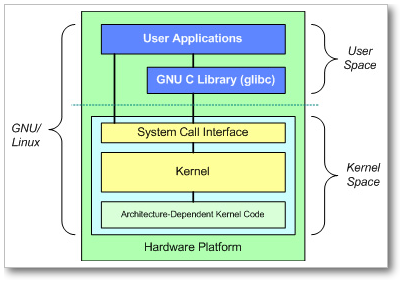

+++
menutitle = "Linux Kernel"
date = 2018-12-29T17:15:52Z
weight = 5
chapter = false
pre = "<b>- </b>"
+++

# Linux Kernel Architecture

At the top is the user, or application, space. This is where the user applications are executed.
Below the user space is the kernel space.

There is also the GNU C Library (glibc). This provides the system call interface that connects to the kernel and provides the mechanism to transition between the user-space application and the kernel. This is important because the kernel and user application occupy different protected address spaces. And while each user-space process occupies its own virtual address space, the kernel occupies a single address space.

The Linux kernel can be further divided into three gross levels.

* At the top is the system call interface, which implements the basic functions such as read and write.
* Below the system call interface is the kernel code, which can be more accurately defined as the architecture-independent kernel code. This code is common to all of the processor architectures supported by Linux.
* Below this is the architecture-dependent code, which forms what is more commonly called a BSP (Board Support Package). This code serves as the processor and platform-specific code for the given architecture.

The Linux kernel implements a number of important architectural attributes. At a high level, and at lower levels, the kernel is layered into a number of distinct subsystems.
