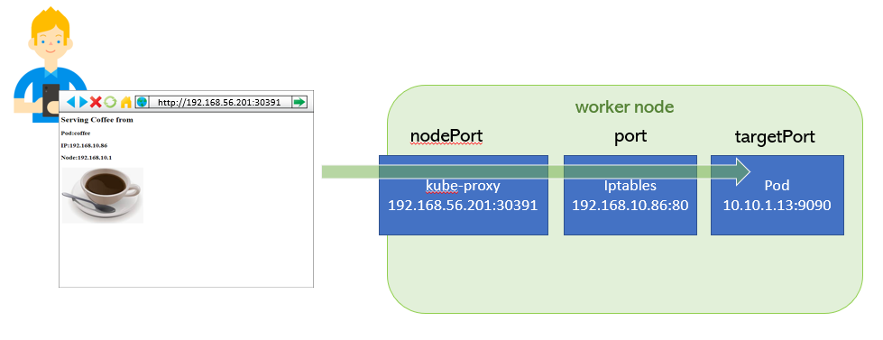

+++
menutitle = "Expose Pod"
date = 2018-12-29T17:15:52Z
weight = 1
chapter = false
pre = "<b>- </b>"
+++

# Expose service running on Pod.

#### Service
A Coffee Pod running in cluster and its listening on port 9090 on Pod's IP.
How can we expose that service to external world so that users can access it ?


We need to `expose` the service.

As we know , the Pod IP is not routable outside of the cluster.
So we need a mechanism to reach the host's port and then that traffic should be diverted to Pod's port.

Lets create a Pod Yaml first.

```shell
$ vi coffe.yaml
```

```yaml
apiVersion: v1
kind: Pod
metadata:
  name: coffee
spec:
  containers:
  - image: ansilh/demo-coffee
    name: coffee
```
Create Yaml
```
$ kubectl create -f coffe.yaml
```

Expose the Pod with below command
```
$ kubectl expose pod coffee --port=80 --target-port=9090  --type=NodePort
```

This will create a `Service` object in kubernetes , which will map the Node's port 30836 to `Service` IP/Port 192.168.10.86:80

We can see the derails using `kubectl get service` command  
```
$ kubectl get service
NAME         TYPE        CLUSTER-IP       EXTERNAL-IP   PORT(S)        AGE
coffee       NodePort    192.168.10.86    <none>        80:30391/TCP   6s
kubernetes   ClusterIP   192.168.10.1     <none>        443/TCP        26h
```

We can also see that the port is listening and kube-proxy is the one listening on that port.

```
$ sudo netstat -tnlup |grep 30836
tcp6       0      0 :::30391                :::*                    LISTEN      2785/kube-proxy
```


kube-proxy watches the Kubernetes master for the addition and removal of Service and Endpoints objects.

(We will discuss about `Endpoints` later in this session.)

For each `Service`,  it opens a port (randomly chosen) on the local node. Any connections to this “proxy port” will be proxied to one of the Service’s backend Pods (as reported in Endpoints). Lastly, it installs iptables rules which capture traffic to the Service’s `clusterIP` (which is virtual) and Port and redirects that traffic to the proxy port which proxies the backend Pod.

